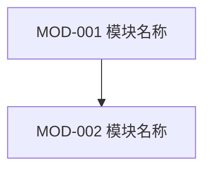
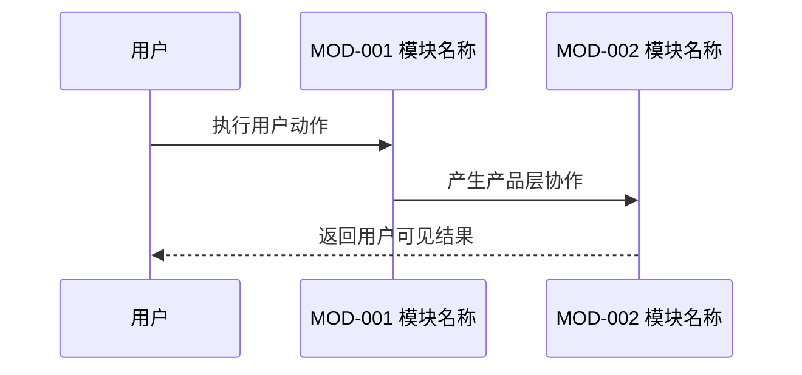

# 04 产品架构设计

> 本文档定义产品能力结构、功能模块、模块边界、核心业务对象和需求到功能任务的组织关系。它不是技术架构文档，不写数据库、接口、缓存、消息队列、部署或模型供应商。

## 0. 文档元信息

**生成说明**：产品架构位于 PRD 之后、功能任务规格之前，用于把平铺需求归纳为产品模块，避免直接从 REQ 跳到零散 FEAT。

| 字段 | 内容 |
|---|---|
| document_id | PRODUCT-ARCH-001 |
| instance_id | SPI-xxx |
| version | v0.1 |
| product_name |  |
| base_requirement_analysis | REQ-ANALYSIS-001 |
| base_prd | PRD-001 |
| generated_at |  |
| document_goal | 定义产品模块结构、模块边界、核心业务对象和 REQ 到 FEAT 的组织关系 |
| downstream_consumers | 产品经理 AI / 架构师 AI / 研发 AI / 测试 AI / 前端 AI |

## 1. 产品架构目标

**生成说明**：说明为什么需要这些模块，以及这些模块如何支撑产品目标。

| arch_goal_id | 架构目标 | 关联产品目标 | 说明 |
|---|---|---|---|
| PARCH-GOAL-001 |  | GOAL-xxx |  |

## 2. 产品能力地图

**生成说明**：用产品能力层级表达“用户看到的能力”和“支撑能力”之间的关系。能力不是技术服务，也不是研发任务。

| capability_id | 能力名称 | 能力类型 | 说明 | 关联需求 |
|---|---|---|---|---|
| CAP-001 |  | 核心用户能力 / 支撑能力 / 管理能力 / 体验能力 |  | REQ-xxx |

## 3. 功能模块清单

**生成说明**：模块是产品架构的基本组织单位。每个模块应有明确职责、边界和下游功能任务。

| module_id | 模块名称 | 模块职责 | 包含能力 | 不包含内容 | 关联需求 | 关联功能任务 |
|---|---|---|---|---|---|---|
| MOD-001 |  |  | CAP-xxx |  | REQ-xxx | FEAT-xxx |

## 4. 模块边界说明

**生成说明**：明确模块之间如何分工，防止后续 AI 把规则、页面或任务归错模块。

| module_id | 输入 | 输出 | 上游模块 | 下游模块 | 边界规则 |
|---|---|---|---|---|---|
| MOD-001 |  |  | MOD-xxx / 无 | MOD-xxx / 无 |  |

## 5. 核心业务对象

**生成说明**：只定义 PM 阶段需要稳定理解的业务对象，不设计数据库表。

| object_id | 业务对象 | 业务含义 | 关键属性概念 | 关联模块 | 关联规则 |
|---|---|---|---|---|---|
| OBJ-001 |  |  |  | MOD-xxx | BR-xxx |

## 6. 需求到模块映射

**生成说明**：每个核心 REQ 必须至少映射到一个模块；不能直接跳过模块进入功能任务。

| req_id | 需求描述 | 归属模块 | 映射理由 | 后续功能任务 |
|---|---|---|---|---|
| REQ-001 |  | MOD-xxx |  | FEAT-xxx |

## 7. 模块到功能任务映射

**生成说明**：用于指导功能任务规格文档如何组织 FEAT，避免任务平铺。

| module_id | 模块名称 | 功能任务 | 任务边界说明 | 任务生成状态 |
|---|---|---|---|---|
| MOD-001 |  | FEAT-xxx |  | 待生成 / 已生成 / 待确认 |

## 8. 产品架构图

**生成说明**：使用 Mermaid 画出模块关系。节点必须使用稳定 ID 和中文名称，便于后续还原为图。

## 9. 用户任务流与模块协作图

**生成说明**：用 Mermaid 表达用户完成核心任务时，各产品模块如何协作。不要写技术调用链。

## 10. 新项目与迭代处理规则

**生成说明**：说明当前产品架构是新建、继承、局部变更还是待补齐。

| 场景 | 处理方式 |
|---|---|
| 新项目 | 先建立完整模块地图，再生成 FEAT。 |
| 功能迭代 | 先读取既有 `PRODUCT-ARCH-001`，判断新增/修改/废弃哪些模块。 |
| 跳过产品架构 | 允许临时跳过，但必须在功能任务规格中标记模块归属为“待补齐”，并创建待确认问题。 |
| 已有产品架构 | 不重复生成；基于旧架构追加变更说明。 |

## 11. 待确认问题

| question_id | 问题 | 影响范围 | 建议处理 |
|---|---|---|---|
| Q-001 |  |  |  |
